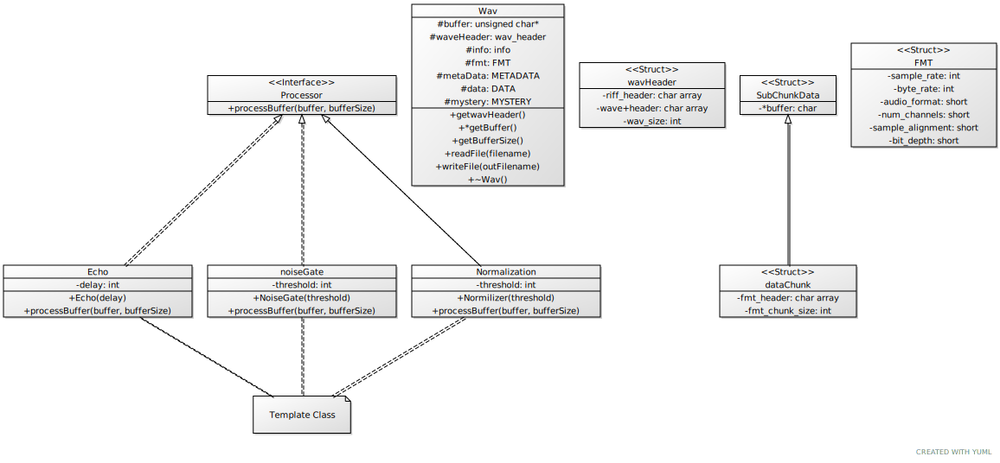

# PT50 Audio File Management System

### Overview
This program will read through audio files provided by the user and prompt allow them to edit the METADATA of the file or process the file with an effect (Echo, Normalization, or a Noise Gate). The program supports mono and stereo .WAV files as well as 8-bit and 16-bit .WAV files. The user is then able to overwrite an existing file's METADATA, or save a new file with the added processing. The user can also create a .CSV file of all the audio files' METADATAs.

### Project Architecture

### The `Processor` Interface
This is an interface with the following function: `processBuffer`

### The `Echo` Template Class
This class is a template with one attribute:

* delay

It has a constuctor:`Echo`

The `processBuffer` function in the Echo class should pass in an audio file and give it an echo of a given delay.

This class inherits from the `Processor` class.

### The `NoiseGate` Template Class
This class is a template with one attribute:

* threshold

It has a constuctor:`NoiseGate`

The `processBuffer` function in the noiseGate class should pass in an audio file and give it a noise gate between a given threshold.

This class inherits from the `Processor` class.

### The `Normalization` Template Class
This class is a template with one attribute:

* threshold

It has a constuctor:`Normilizer`

The `processBuffer` function in the Normalization class should pass in an audio file and give it normalize it to a given limit

This class inherits from the `Processor` class.

### The `WAV` Class
This class is used to provide specifications on the file type, sample rate, sample size and bit size of the file, as well as its overall length. 
This class will also provide the file IO portion for the data, this is where the files are read in and write from and the information from the files are dispalyed. These are stored in a vector.

### The `WAV Header` File
This file conatains all the details about the files, ie file type, sample rate, sample size and bit size of the file, as well as its overall length. They are build into structs and these pieces of information are contained as unsigned chars and shorts, and ints store the size of these data chunks.

### The Driver (main.cpp)
This file displays a menu to the user prompting them of 4 different options. The user must pass in the acceptable command line arguments to get to the user menu. Option 1 allows the user to create or modify the METADATA of a file. Option 2 processes the file, allowing the user to add up to 3 different effects to the audio file which are echo, normalization, or a noise gate. Option 3 will write the files to new files. Option 4 will end the program.
